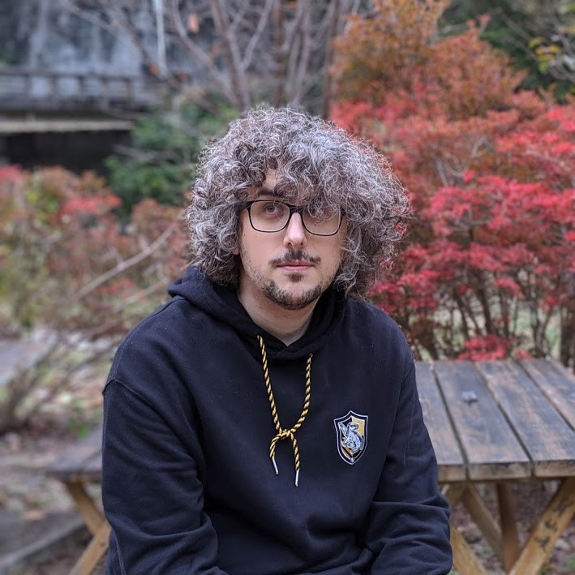

## About Me

I am a research engineer currently working on neural network accelerated soft-body simulations for games.

## Research Interest

I am working on robust computation in/with dynamical systems. Further, I am also highly interested in morphological computing and its applications based on (physical) reservoir computing.

## Misc Interest

Next, to my research, I am also interested in computer graphics, namely ray tracing/marching, and general game development.

## Vocational Experience

When | What | Where
-----|------|------
4.2023-current | R&D ML Engineer | Bandai Namco Studios, Japan
5.2021-4.2023 | Research Associate for Safety-Critical Systems | ZHAW - Institute of Applied Mathematics and Physics, Switzerland
3.2020-1.2021 | AI Engineer | Cross Compass, Japan
9.2019-3.2020 | Research/Software Engineer - Intern | Corpy & Co, Japan
8.2017-12.2018 | Research Associate for Safety-Critical Systems | ZHAW - Institute of Applied Mathematics and Physics, Switzerland
2.2016-8.2016 | Research Assistant for Safety-Critical Systems | ZHAW - Institute of Applied Mathematics and Physics, Switzerland
8.2014-1.2016 | Research in Machine Learning | SIIT, Thammasat University, Thailand
12.2007-8.2009 | Network Engineer | Baggenstos & Co AG, Switzerland
8.2003-7.2007 | Draughtsman | AWZ and Hug Engineering, Switzerland

## Education

When | What | Where
-----|------|------
4.2019-3.2024 | Doctorate in Information and Communications Engineering | Tokyo Institute of Technology, Kumazawa Laboratory, Japan
9.2016-9.2018 | Master of Engineering in Information and Communications Engineering | Tokyo Institute of Technology, Kumazawa Laboratory, Japan
9.2010-7.2014 | BSc UAS Computer Science | ZHAW - School of Engineering, Switzerland
8.2009-7.2009 | Professional Baccalaureate | Berufsbildungsschule Winterthur, Switzerland
8.2007-7.2009 | Federal professional certification as a network engineer | ZLI, Switzerland
8.2003-7.2007 | Federal professional certification as a draughtsman | AZW, Switzerland

## Publications
- C. W. Senn: Memory in conductive fabrics for reservoir computing, International Journal of
Unconventional Computing, 2024.
- C. Frischknecht-Gruber, B. Ricchiuto, M. Reif, J. Weng, and C. Senn: Ensuring safety in
highly automated vehicles: A review of testing and validation methods for robustness and
reliability, in ESREL 2023.
- C. Frischknecht-Gruber, M. Reif, C. W. Senn: A review of global efforts towards establishing safety directives for intelligent systems, ESREL2022.
- S. Brunner, C. Frischknecht-Gruber, M. Reif, C. W. Senn: Deep Gaussian Mixture Model - A Novelty Detection Method for Time Series, ESREL2022.
- C. W. Senn, I. Kumazawa: Abstract Reservoir Computing, AI.
- C. W. Senn, I. Kumazawa: Robust Echo State Networks, JNNS2019
- C. Frischknecht-Gruber, M. Marti, C. W. Senn, B. Contreras, and S. S. Krauss: Integration of
security into cast, 2nd Japanese STAMP Workshop
- S. S. Krauss, M. Rejzek, C. W. Senn, and C. Hilbes: Sahra - an integrated software tool for
stpa, 4th European STAMP Workshop.
- S. S. Krauss, M. U. Reif, M. Rejzek, C. W. Senn, and C. Hilbes: Stpa – sicherheitsanalyse für
komplexe systeme,  safe.tech 2016.
- C. W. Senn and T. Theeramunkong: Speed prediction using L-reservoirs, Tenth International Conference on Knowledge, Information and Creativity Support Systems (KICSS2015).
- R. Bernhardsgruetter, C. W. Senn, R. M. Fuechsling, C. Jaeger, K. Nakajima, H. Hauser: Employing L-Systems to Generate Mass-Spring Networks for Morphological Computing, NOLTA2014

## Awards, Achievements and Scholarships

Year | Award | Description
-----|-------|--------
2019 | SANS NetWars Coin | Ranked 7 out of 94 at the NRI Secure NetWars 2019 in Tokyo.
2018 | MEXT Scholarship | Awarded MEXT scholarship for my doctoral studies.
2016 | MEXT Scholarship | Awarded MEXT scholarship for my master studies.
2010 | SoE Award | Best result cantonwide (Zurich) in completing my professional baccalaureate.

---

## References
Upon request

